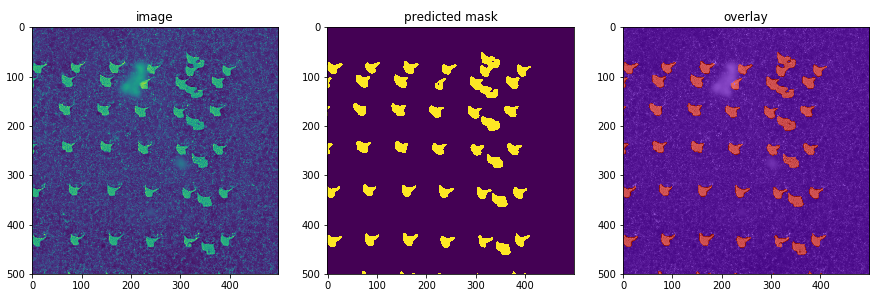
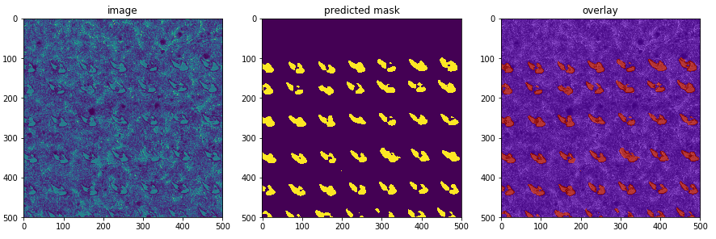

# Intro
The project provides tools for training and applying Deep Learning models of U-Net like architecture for semantic segmentation of microscopy images of ablation marks after MALDI imaging mass spectrometry.
The models are based on [TernausNet](https://github.com/ternaus/TernausNet) and [segmentation_models.pytorch](https://github.com/qubvel/segmentation_models.pytorch).

Segmentation results:





# Installation and setup (user)

Install the neu.ro client, sign up for the service, and perform initial AM segm setup
```
pip install -U neuromation
neuro login

make am-setup
```

# Installation and setup (admin)

Install the dependencies for local development
```
pip install -r requirements.txt
```

Build a Docker image. Grant permissions to use the Docker image
```
make build-push
make share-image SHARE_WITH_USER=<user>
```

# Getting started

Download and unpack sample data

```
mkdir -p data/getting-started
cd data/getting-started

wget https://am-segm.s3-eu-west-1.amazonaws.com/getting-started/training-data.zip
unzip training-data.zip

wget https://am-segm.s3-eu-west-1.amazonaws.com/getting-started/dataset.zip
unzip dataset.zip

cd ../..
```

Upload the training data to neu.ro and train a model
```
make upload-train-data TRAIN_DATA_DIR=data/getting-started/training-data
make train TRAIN_DATA_DIR=data/getting-started/training-data
make download-train-results
```

Split the dataset images into tiles. Pick the tile size so that there are <= 50 ablation marks per tile.
Upload them to neu.ro and use the trained model to segment the dataset.
```
python scripts/split_to_tiles.py data/getting-started/dataset/Luca_Well4_UL --tile-size 512
make upload-predict-data PREDICT_DATA_DIR=data/getting-started/dataset/Luca_Well4_UL/tiles
make predict PREDICT_DATA_DIR=data/getting-started/dataset/Luca_Well4_UL/tiles
make download-predict-results PREDICT_DATA_DIR=data/getting-started/dataset/Luca_Well4_UL/tiles
python scripts/stitch_tiles.py data/getting-started/dataset/Luca_Well4_UL
```

Run ablation marks registration script. Based on the ablation marks segmentation mask, the script will assign ids in row-wise manner to all ablation marks, starting with 1 at the top left corner. The acquisition grid size (rows x cols) needs to be provided
```
python scripts/register_ams.py data/getting-started/dataset/Luca_Well4_UL --rows 60 --cols 60
```

To overlay source and mask images in tiles_stitched
```
python scripts/overlay_image_mask.py data/getting-started/dataset/Luca_Well4_UL
```

# Data
The model training is done on a wide range of different images obtained from 
microscopy of samples after acquisition with MALDI imaging mass spectrometry.

Sample data can be downloaded from AWS S3 using
```
wget https://am-segm.s3-eu-west-1.amazonaws.com/post-MALDI-IMS-microscopy.tar.gz
```

It is important to notice that usually these microscopy images are quite large, e.g.
5000x5000 pixels. As most of the segmentation networks are not designed for images
of such resolution, additional steps for image slicing and stitching
have to be added to the pipeline.

## Dataset directory structure

* `source` - dataset input images
    * `Well4_UL` - dataset group, dataset has >=1 groups with one image per group
* `source_norm` - intensity normalized images
* `tiles` - input images split into tiles for parallel segmentation
    * `Well4_UL/source` - input tiles
    * `Well4_UL/mask` - predicted masks
* `tiles_stitched` - stitched images, masks and their overlays
* `am_coords` - final output, label encoded segmentation mask, each ablation mark has its own id

```
$ tree -d data/getting-started/dataset

data/getting-started/dataset
└── Luca_Well4_UL
    ├── am_coords
    │   └── Well4_UL
    ├── source
    │   └── Well4_UL
    ├── source_norm
    │   └── Well4_UL
    ├── tiles
    │   └── Well4_UL
    │       ├── mask
    │       └── source
    └── tiles_stitched
        └── Well4_UL
```

## Training data directory structure

The top level directory has subdirectories with training and validation data accordingly

* `train`, `valid` - data type
    * `Luca_Well4_UL` - dataset name
        * `Well4_UL` - dataset group name

```
$ tree -d data/getting-started/training-data

data/getting-started/training-data
├── train
│   └── Luca_Well4_UL
│       └── Well4_UL
│           ├── mask
│           └── source
└── valid
    └── Luca_Well4_UL
        └── Well4_UL
            ├── mask
            └── source
```

# Training

The best performing model turned to be U-net with
[ResNeXt-50 (32x4d)](https://arxiv.org/abs/1611.05431) as encoder from
[segmentation_models.pytorch](https://github.com/qubvel/segmentation_models.pytorch)
by Pavel Yakubovskiy

## AWS SageMaker

Add AWS IAM user credentials into the boto3 config

```
# ~/.aws/credentials

[am-segm]
aws_access_key_id = <user-key-id>
aws_secret_access_key = <user-secret-key>

```

Build a Docker image for training with AWS SageMaker

```
./build-and-push.sh train
```

The script for training a dataset optimized model

```
$ python scripts/train.py -h

usage: train.py [-h] --matrix MATRIX [--local] fine_tuning_path

Train AM segmentation model with SageMaker

positional arguments:
  fine_tuning_path  Path to fine tuning data

optional arguments:
  -h, --help        show this help message and exit
  --matrix MATRIX   'DHB' or 'DAN'
  --local           Run training locally

```

## Pseudo-labeling

As original data usually does not come with masks, a semi-supervised approach for
getting image masks is used.
* Fist a few small areas of the input image are selected and manually segmented
* Simple and fast model with lots of regularisation to prevent overfitting is trained
* The trained model is used to predict full mask for the image
* The full mask for multiple images already can be used for more intensive training
of a bigger model

## Notebooks

To explore the model training Jupyter notebook:
* Spin up Jupyter server and open `pytorch-unet.ipynb` notebook

# Inference

## AWS Elastic Container Service (ECS)

Add AWS IAM user credentials into the boto3 config

```
# ~/.aws/credentials

[am-segm]
aws_access_key_id = <user-key-id>
aws_secret_access_key = <user-secret-key>

```

Build a Docker image for inference (prediction) with AWS ECS

```
./build-and-push.sh predict
```

The script for dataset segmentation

```
$ python scripts/inference.py -h

usage: inference.py [-h] [--tile-size TILE_SIZE] [--rows ROWS] [--cols COLS] [--debug] [--no-register] ds_path [groups [groups ...]]

Run AM segmentation pipeline

positional arguments:
  ds_path               Dataset directory path
  groups

optional arguments:
  -h, --help            show this help message and exit
  --tile-size TILE_SIZE
  --rows ROWS
  --cols COLS
  --debug
  --no-register

```

## Run inference container locally

* Build image and start container
```
docker build -t am-segm/ecs-pytorch-predict -f ecs/Dockerfile .
docker run -p 8000:8000 --name am-segm --rm am-segm
```

* Submit a segmentation task
```
http POST localhost:8000/tasks Content-Type:image/png < api-use/source_small.png

HTTP/1.0 201 Created
Date: Mon, 07 Jan 2019 22:48:58 GMT
Server: WSGIServer/0.2 CPython/3.7.2
content-length: 0
content-type: application/json; charset=UTF-8
location: /tasks/c0bfec01-a8a4-431b-8d3d-56e43708c877
```
* Check task status
```
http localhost:8000/tasks/c0bfec01-a8a4-431b-8d3d-56e43708c877

HTTP/1.0 200 OK
Date: Mon, 07 Jan 2019 22:49:51 GMT
Server: WSGIServer/0.2 CPython/3.7.2
content-length: 20
content-type: application/json; charset=UTF-8

{
    "status": "QUEUED"
}
```
* Once status is "FINISHED", get predicted mask
```
http localhost:8000/masks/c0bfec01-a8a4-431b-8d3d-56e43708c877

HTTP/1.0 200 OK
Date: Mon, 07 Jan 2019 22:52:30 GMT
Server: WSGIServer/0.2 CPython/3.7.2
content-length: 171167
content-type: image/png

+-----------------------------------------+
| NOTE: binary data not shown in terminal |
+-----------------------------------------+

```
